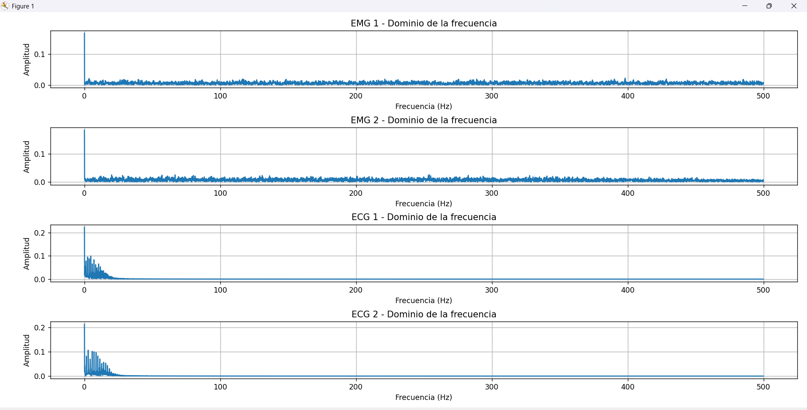
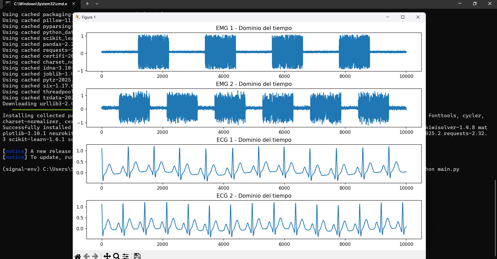

# 🔧 Laboratorio 2 - Setup para proyectos de señales

Este repositorio corresponde al segundo laboratorio del curso de Instrumentación Biomédica. A continuación, se describe **paso por paso** lo realizado, desde la preparación del entorno hasta la ejecución del código y la visualización de resultados.

---

## 🧠 Paso a paso realizado

### 1️⃣ Crear carpeta de trabajo

Se creó una carpeta con el nombre solicitado por el docente:  
`Laboratorio 2 - Setup para proyectos de señales`.

Dentro de ella se organizaron todos los archivos del laboratorio.

---

### 2️⃣ Crear entorno virtual de Python

Desde la terminal se ejecutó:

```bash
python -m venv signal-env
```

Esto generó una carpeta `signal-env` con el entorno virtual.

---

### 3️⃣ Activar entorno virtual

- En **Windows**:

```bash
.\signal-env\Scripts\activate
```

- En **Mac/Linux**:

```bash
source signal-env/bin/activate
```

Cuando se activa correctamente, el prompt se ve así:

```
(signal-env) C:\Users\Usuario\...
```

---

### 4️⃣ Instalar librerías necesarias

Con el entorno activado se ejecutó:

```bash
pip install neurokit2 matplotlib scipy
```

Esto permitió trabajar con señales biológicas, graficar y hacer análisis en frecuencia.

Luego se generó un archivo `requirements.txt` con el contenido:

```
neurokit2
matplotlib
scipy
```

---

### 5️⃣ Crear y editar archivo `main.py`

Se escribió un script que:

- Simula **2 señales EMG**:
  - Una con 4 bursts
  - Otra con 6 bursts y ruido
- Simula **2 señales ECG**:
  - Una con 70 bpm
  - Otra con 85 bpm y ruido
- Grafica todas las señales en:
  - 🔹 Dominio del tiempo
  - 🔹 Dominio de la frecuencia (con FFT)

---

### 6️⃣ Ejecutar el código

Se ejecutó el script con:

```bash
python main.py
```

Esto generó 2 ventanas emergentes con los gráficos solicitados.

---

### 7️⃣ Guardar evidencia visual

Se tomaron capturas de pantalla de los resultados. Están guardadas en la carpeta `/images`:

#### 📷 Gráfica 1 – Dominio del tiempo



#### 📷 Gráfica 2 – Dominio de la frecuencia



---

### 8️⃣ Crear archivo `.gitignore`

Se creó un `.gitignore` con:

```
signal-env/
```

Esto evita subir el entorno virtual al repositorio.

---

### 9️⃣ Subida del proyecto a GitHub

Se subieron los siguientes archivos:

- `main.py`
- `requirements.txt`
- `README.md`
- `.gitignore`
- Carpeta `images/` con las capturas

✅ La carpeta `signal-env` **NO se subió** como indica la consigna.

---

## ✅ Conclusión

Este laboratorio incluyó:

- Creación de entorno virtual
- Instalación de librerías
- Simulación de 4 señales biológicas (EMG y ECG)
- Gráficas en el dominio del tiempo y la frecuencia
- Documentación clara y completa paso a paso

