# Laboratorio 3: Análisis de EMG con BitaLino  

En este laboratorio nos enfocamos en registrar y analizar señales electromiográficas (EMG) a partir de la plataforma BITalino. Este dispositivo ha demostrado ser una herramienta confiable para la adquisición de biosensores en diferentes investigaciones, con resultados equiparables a los de equipos comerciales (1,2).

## Introducción
El objetivo principal fue capturar y evaluar la actividad muscular en tres grupos específicos: bíceps braquial, deltoides lateral y bíceps femoral, tanto en reposo como durante tareas que exigen distintos niveles de esfuerzo. Además de comprobar el funcionamiento básico del BITalino, se buscó observar la influencia de la fatiga en la amplitud y características de la señal EMG.

## Objetivos
1. Configurar y ejecutar la adquisición de señales EMG utilizando BitaLino.  
2. Registrar la actividad eléctrica de los músculos seleccionados en reposo y en actividad.  
3. Examinar la variación de la amplitud y la presencia de ruido en las señales bajo diferentes condiciones.  
4. Generar gráficos que muestren la respuesta EMG y discutir los hallazgos más relevantes.

## Materiales y metodología

### Materiales
- BitaLino  
  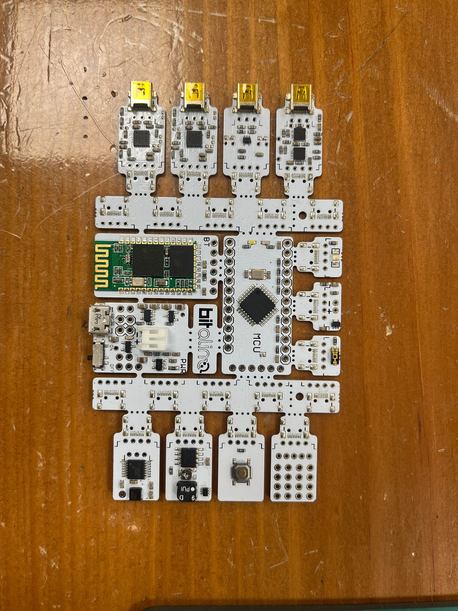
- Laptop
- Electrodos  
  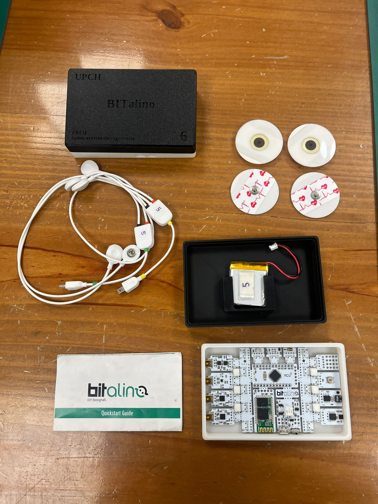
- Script de OpenSignal

### Metodología
1. **Conexión y configuración:** Se conectó el BitaLino a la computadora a través de Bluetooth y se aseguraron las configuraciones necesarias en el software OpenSignal.  
   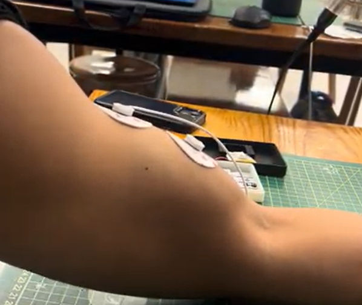 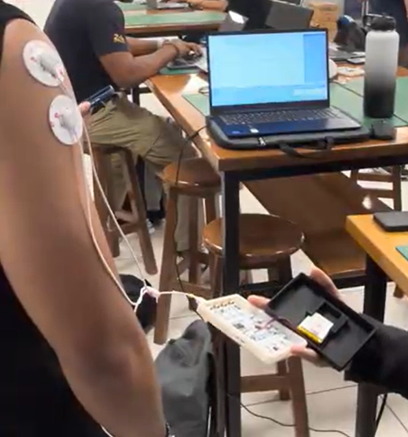

2. **Colocación de electrodos:** Se ubicaron los electrodos en la zona muscular de interés (bíceps braquial, deltoides lateral), siguiendo las recomendaciones de anatomía para obtener lecturas más fiables.  

3. **Registro de señales en reposo:** Cada músculo se midió durante 30 segundos sin realizar actividad física intencional.  

4. **Registro de señales con actividad:**  
   - **Bíceps braquial:** Se realizaron curls de bíceps con y sin carga.  
   - **Deltoides lateral:** Se llevaron a cabo elevaciones laterales simples y con contrapeso.  
   En todos los casos, se mantuvo la medición durante 30 segundos, repitiendo tomas para comparar resultados y observar la aparición de fatiga.  

5. **Adquisición de datos:** Se almacenaron las señales obtenidas a lo largo de cada sesión y se generaron los correspondientes gráficos a partir de la información recopilada.

## Videos de registro

A continuación se enlazan los videos correspondientes a cada sesión experimental. En ellos se muestra la conexión de electrodos y la realización de los ejercicios en cada condición (reposo, contracción simple y contracción con contrapeso), lo que facilita el análisis contextual de las señales.

### Bíceps braquial

- **Reposo:**  
  - [Toma reposo – Bíceps](https://drive.google.com/file/d/1ou7gz9C0gXnLimJu7HMcETf8snbXXJhl/view?usp=sharing)

- **Contracción simple (curl de bíceps):**  
  - [Toma 1](https://drive.google.com/file/d/1ZBnxqPcMhYi1JdIMZcHu9aHS5jDJ9y2o/view?usp=sharing)  
  - [Toma 2](https://drive.google.com/file/d/1Kz933VxDD_z7_xWAUoA1jPidlAEPdVVn/view?usp=sharing)  
  - [Toma 3](https://drive.google.com/file/d/107EHYXOmQXVJVX16lYMqAldProqZGe_Y/view?usp=sharing)

- **Contrapeso (con carga):**  
  - [Toma 1](https://drive.google.com/file/d/1t-0d8j15b8cYoNjau60LEZ27hyakmI-5/view?usp=sharing)  
  - [Toma 2](https://drive.google.com/file/d/137KolTSUziCZgZFIl6hY_IMVS2DdGwo-/view?usp=sharing)  
  - [Toma 3](https://drive.google.com/file/d/1jht2VI0u8mbcEANUt_-v32rlEKFJW6FR/view?usp=sharing)

### Deltoides lateral

- **Reposo:**  
  - [Toma reposo – Deltoides](https://drive.google.com/file/d/18p22JrYv38N5F9x_m6AigM1L2V8P_3-j/view?usp=sharing)

- **Contracción simple (elevación lateral):**  
  - [Toma 1](https://drive.google.com/file/d/1vO1vLFR57mSN-q1HQZzkEl9Hz0T00qBl/view?usp=sharing)  
  - [Toma 2](https://drive.google.com/file/d/1nd_9MNHqxO7vNAqhpJ7EhBq3iyre8je8/view?usp=sharing)  
  - [Toma 3](https://drive.google.com/file/d/1ZU8uy4eAhLbxjZvlXJTSTeval90Yre8D/view?usp=sharing)

- **Contrapeso (con carga):**  
  - [Toma 1](https://drive.google.com/file/d/1r3fbSumU9PJPO1xza9l91hhUj8mg4lyB/view?usp=sharing)  
  - [Toma 2](https://drive.google.com/file/d/1NGn6QaVBCJNQptA5XYQhzWjQf1nK7VBp/view?usp=sharing)  
  - [Toma 3](https://drive.google.com/file/d/1d8HDOhkKJgR4Az1W65tEmTlfPdCppV9G/view?usp=sharing)

## Visualización de señales EMG

A continuación se presentan las señales capturadas en las diferentes condiciones experimentales (reposo, contracción simple y contracción con peso) para los músculos bíceps y deltoides. Se incluyen tanto los gráficos generados en **Python** a partir de los archivos `.txt`, como los gráficos visualizados en el software **OpenSignals** (BITalino).

### Señales del músculo bíceps

| Condición              | Python (`images_python`)                          | OpenSignals (`images`)                         |
|------------------------|---------------------------------------------------|------------------------------------------------|
| **Reposo**             | 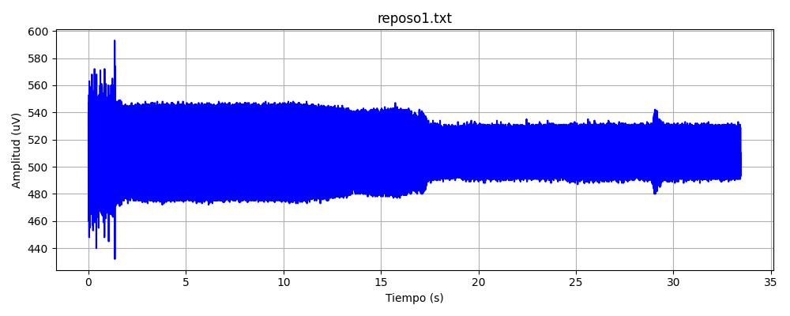       | 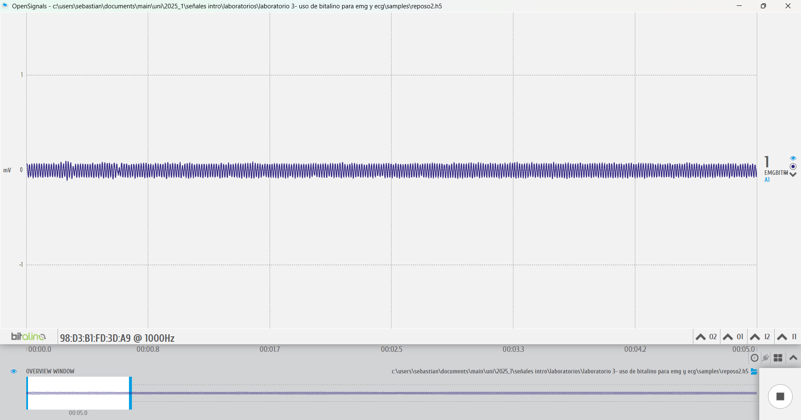     |
| **Contracción simple** | 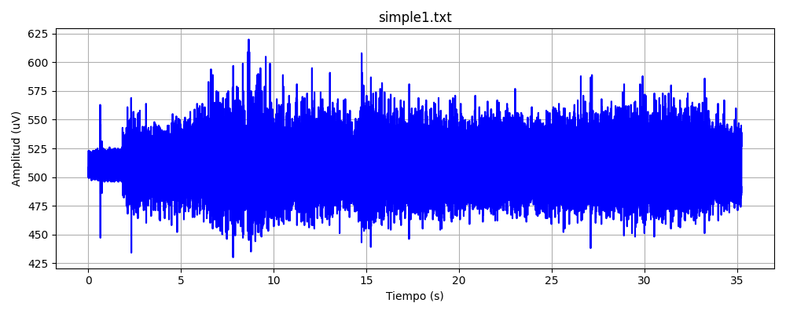      | 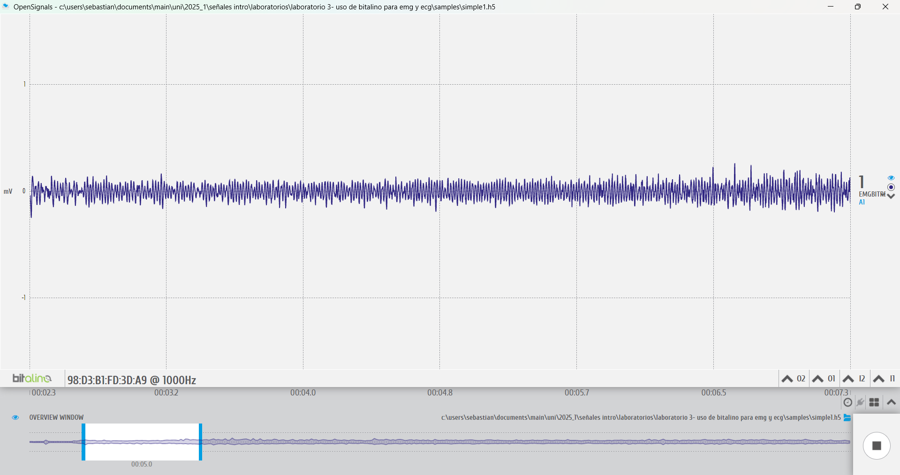     |
| **Contrapeso**         | 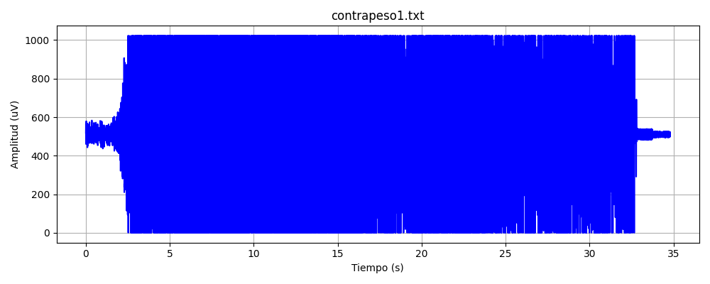  | 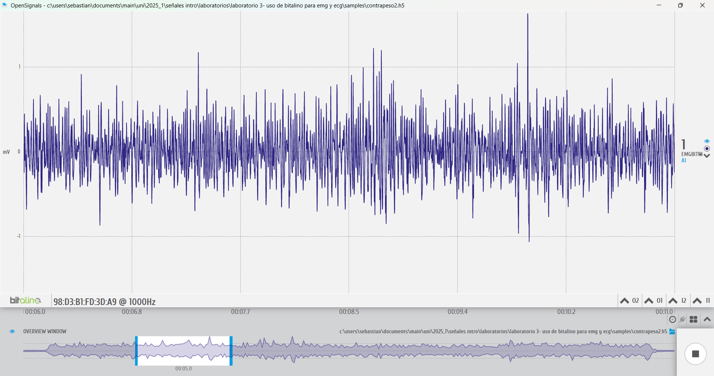      |

### Señales del músculo deltoides

| Condición              | Python (`images_python`)                          | OpenSignals (`images`)                         |
|------------------------|---------------------------------------------------|------------------------------------------------|
| **Reposo**             | 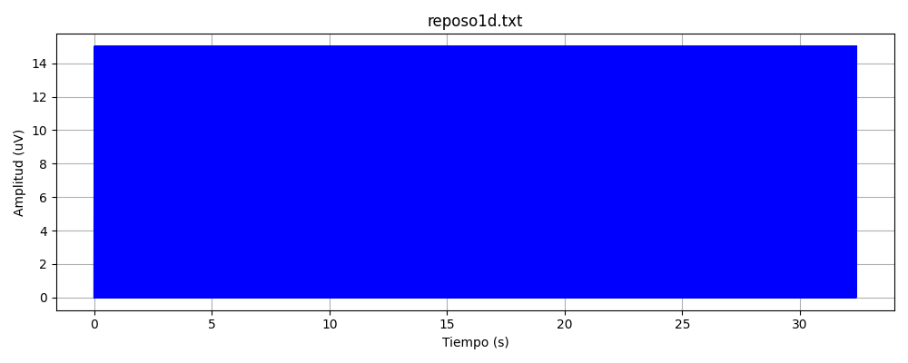      | 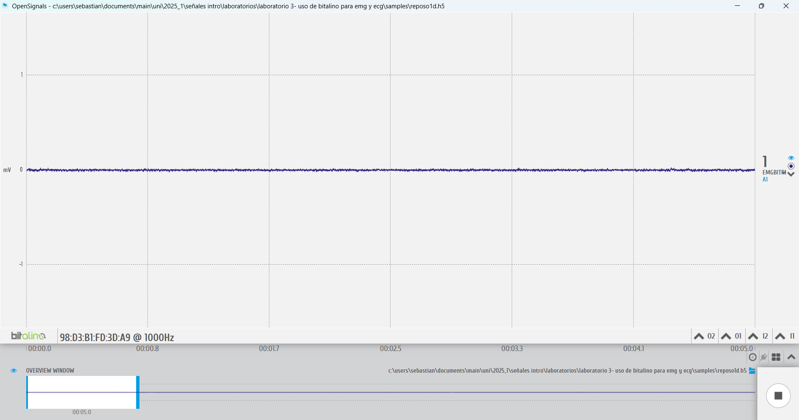     |
| **Contracción simple** | 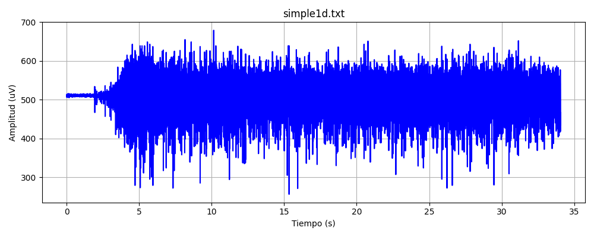    | 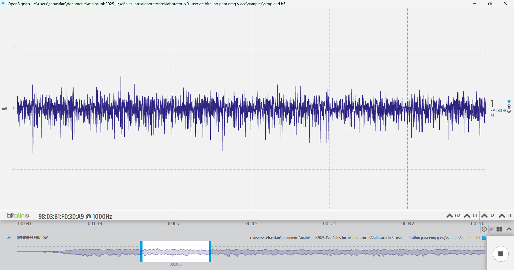      |
| **Contrapeso**         | 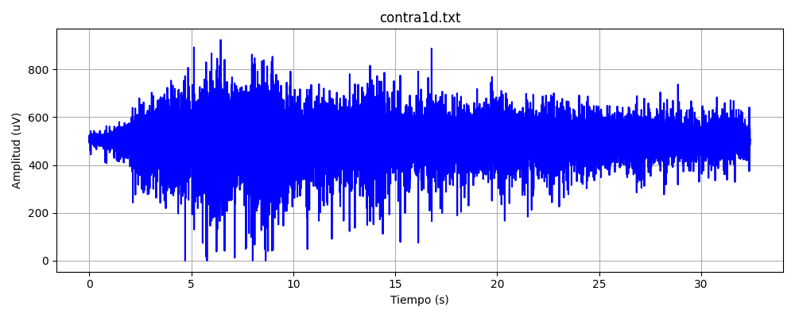      | 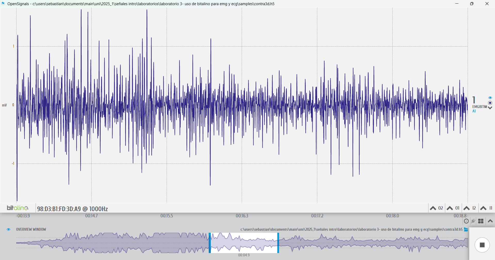      |

Estas gráficas permiten observar visualmente las variaciones de amplitud y presencia de ruido bajo cada condición. Se aprecia que las señales en reposo presentan menor amplitud, mientras que las señales durante contracción (especialmente con peso) muestran picos más marcados y una mayor dispersión, asociadas al esfuerzo muscular y aparición progresiva de fatiga.

---

## Análisis y discusión
Tras revisar los registros EMG obtenidos con BITalino, se pudo observar una clara diferencia en la actividad muscular entre las tres fases: reposo, flexión sin contrapeso y flexión con contrapeso. En estado de reposo, la señal de EMG presenta una amplitud muy baja (<50 µV), siendo más vulnerable a interferencias y ruido de fondo, lo cual es característico en la literatura y esperado al no haber contracción muscular voluntaria.

Durante la fase de flexión sin contrapeso, se registra un aumento moderado de la amplitud (0.2 - 0.5 mV para bíceps y 0.1 - 0.3 mV para deltoides), evidenciando activación de unidades motoras, principalmente de tipo I. A nivel de frecuencia, se identifica un contenido dominante en el rango de 20-60 Hz, asociado a contracciones suaves. Esto está en concordancia con el principio de reclutamiento progresivo descrito por Henneman, donde las unidades motoras de bajo umbral se activan primero [3].

En la fase de flexión con contrapeso, se observa el mayor reclutamiento muscular, con amplitudes que alcanzan hasta 1.5 mV en bíceps y 0.8 mV en deltoides. La señal se vuelve más densa y compleja, con componentes de frecuencia que pueden superar los 100 Hz, representando la participación de unidades motoras tipo II, rápidas y fatigables. Este comportamiento ha sido ampliamente documentado en estudios previos, que relacionan el incremento de carga con mayor amplitud EMG y desplazamiento del espectro de frecuencia hacia componentes más altos [4,5].

También se evidenció la aparición de fatiga muscular en las últimas repeticiones, reflejada en la disminución progresiva de la amplitud de la señal y el aumento de ruido, tal como lo han descrito De Luca et al. [6], asociando estos cambios con disminución en la capacidad de disparo de las unidades motoras y variaciones en la conducción de la fibra.

### Limitaciones 
1. Ruido en las señales: Se registró una alta sensibilidad al ruido, especialmente en reposo. Esto puede deberse a interferencias ambientales, falta de apantallamiento o mal contacto electrodos-piel. Para mejorar la calidad de la señal se recomienda:

-Preparar adecuadamente la piel mediante limpieza y abrasión ligera para reducir la impedancia [7].

-Usar electrodos de calidad clínica y fijarlos correctamente para minimizar el movimiento relativo [8].

-Aplicar filtros pasa banda (20-450 Hz) y notch (50/60 Hz) para eliminar ruido de red [9].

2. Colocación de electrodos: Una mala ubicación puede afectar la interpretación de las señales. Se recomienda seguir las guías de SENIAM para estandarizar la colocación de electrodos [10].

3. Fatiga y variabilidad fisiológica: La fatiga acumulada durante las sesiones afecta los registros. Una solución es controlar el tiempo de descanso entre mediciones y limitar la duración de los protocolos.

### Referencias
1.Martins A, Chen L, Silva H. BITalino: A Wearable Platform for the Acquisition of Biosignals. IEEE Trans Biomed Eng. 2014;61(3):787–97.

2.da Silva RGS, Thompson BC, Freedman P, Harrington L. A Comparative Study of EMG Data Acquired Using BITalino (r)evolution and a Commercial EMG Device for Muscle Activation Detection. In: 2019 IEEE International Symposium on Medical Measurements and Applications (MeMeA). Piscataway, NJ: IEEE; 2019. p. 1–5.

3.Henneman E, Somjen G, Carpenter DO. Functional significance of cell size in spinal motoneurons. J Neurophysiol. 1965;28(3):560–80.

4.De Luca CJ. The use of surface electromyography in biomechanics. J Appl Biomech. 1997;13(2):135–63.

5.Farina D, Merletti R, Enoka RM. The extraction of neural strategies from the surface EMG. J Appl Physiol. 2004;96(4):1486–95.

6.De Luca CJ, LeFever RS, McCue MP, Xenakis AP. Behaviour of human motor units in different muscles during linearly varying contractions. J Physiol. 1982;329(1):113–28.

7.Hermens HJ, Freriks B, Disselhorst-Klug C, Rau G. Development of recommendations for SEMG sensors and sensor placement procedures. J Electromyogr Kinesiol. 2000;10(5):361–74.

8.Rainoldi A, Nazzaro M, Merletti R, Farina D, Caruso I, Gaudenti S. Geometrical factors in surface EMG: a simulation study. Biomed Eng Online. 2004;3:1.

9.Konrad P. The ABC of EMG: A Practical Introduction to Kinesiological Electromyography. Noraxon USA Inc.; 2005.

10.SENIAM. Surface Electromyography for the Non-Invasive Assessment of Muscles [Internet]. [cited 2025 Apr 13]. Available from: http://www.seniam.org/
