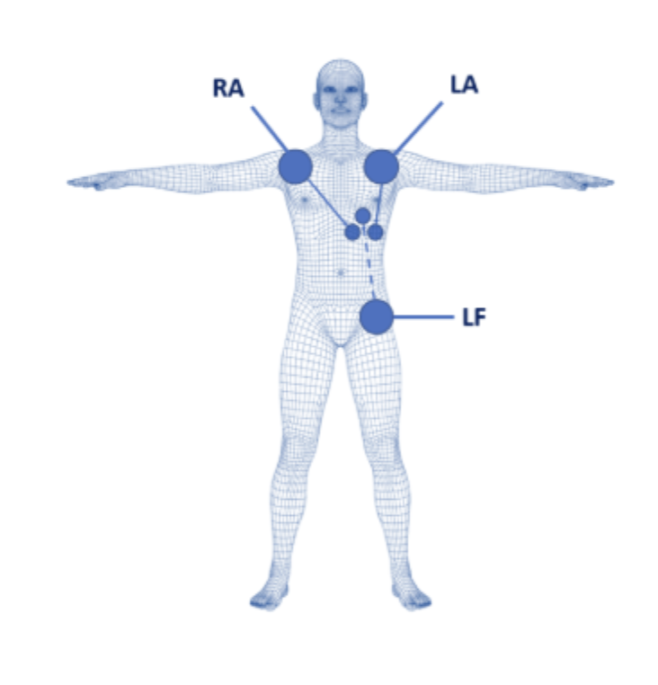

# Laboratorio 4

## Introducción
El electrocardiograma (ECG) es un procedimiento no invasivo que registra la actividad eléctrica del corazón mediante electrodos colocados en puntos específicos del cuerpo. Esta técnica permite detectar diversas patologías cardíacas como arritmias, cardiomiopatías, enfermedades	 de las arterias coronarias, entre otras [1]. La señal obtenida se analiza a través de ondas características (P, QRS y T), cada una representando un evento eléctrico específico dentro del ciclo cardíaco. [1]
Para lograr un análisis estructurado, se utilizan derivaciones, que son combinaciones específicas de estos electrodos. Entre las principales se encuentran las derivaciones bipolares de Einthoven: Lead I, Lead II y Lead III, las cuales forman el denominado triángulo de Einthoven. Este triángulo conecta los brazos derecho (RA) e izquierdo (LA) y la pierna izquierda (LL), permitiendo visualizar la dirección y magnitud de la despolarización cardíaca en diferentes ejes.

La derivación Lead I mide la diferencia de potencial entre el brazo derecho (RA, negativo) y el brazo izquierdo (LA, positivo). Lead II mide entre el brazo derecho (RA, negativo) y la pierna izquierda (LL, positivo). Finalmente, Lead III registra entre el brazo izquierdo (LA, negativo) y la pierna izquierda (LL, positivo). Estas tres derivaciones permiten obtener una visión completa de la actividad eléctrica en el plano frontal del corazón.
En esta práctica, se utilizó el kit BITalino (r)evolution junto con el software OpenSignals para adquirir señales de ECG. Se trabajó inicialmente con Lead I, colocando electrodos en las clavículas (RA y LA) y la referencia en la cresta ilíaca, y luego se configuraron Lead II y Lead III para completar el registro según el esquema de Einthoven.

## Objetivos específicos de la práctica
1. Adquirir señales biomédicas de ECG utilizando el kit BITalino (r)evolution.
2. Realizar la correcta configuración del dispositivo BITalino y del software OpenSignals (r)evolution.
3. Extraer, visualizar y analizar las señales ECG obtenidas en diferentes condiciones fisiológicas (reposo, apnea, post ejercicio)

