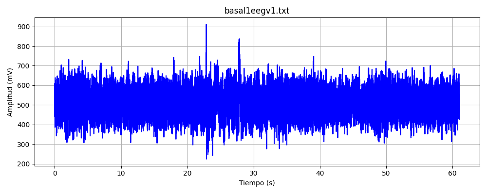
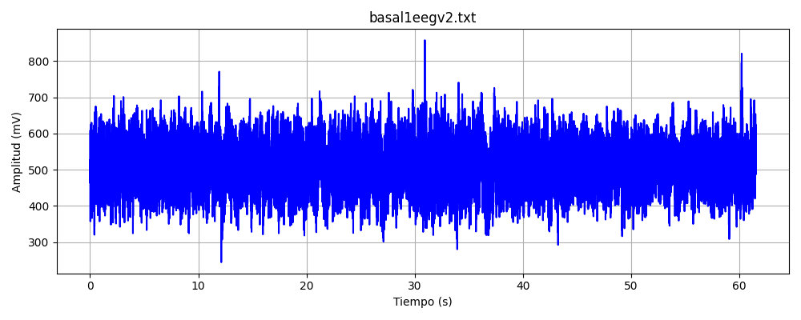
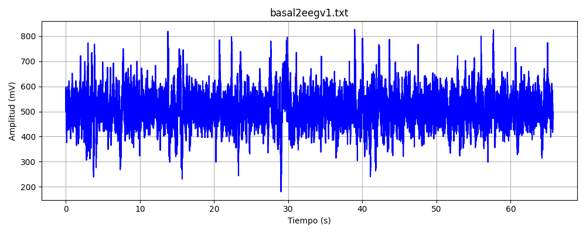
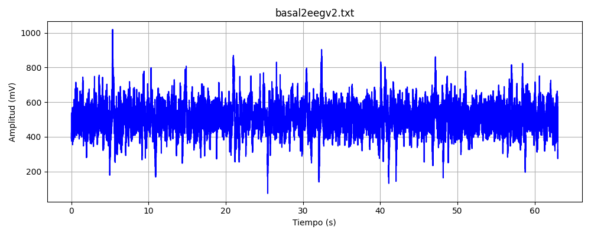
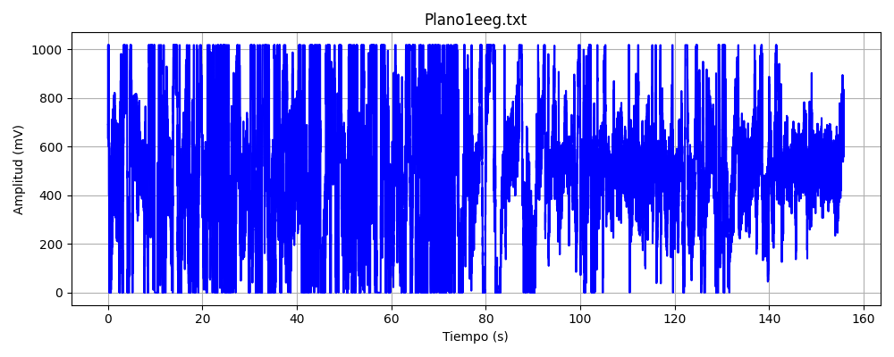
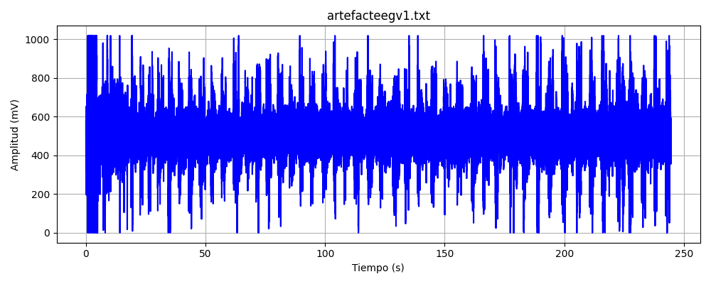
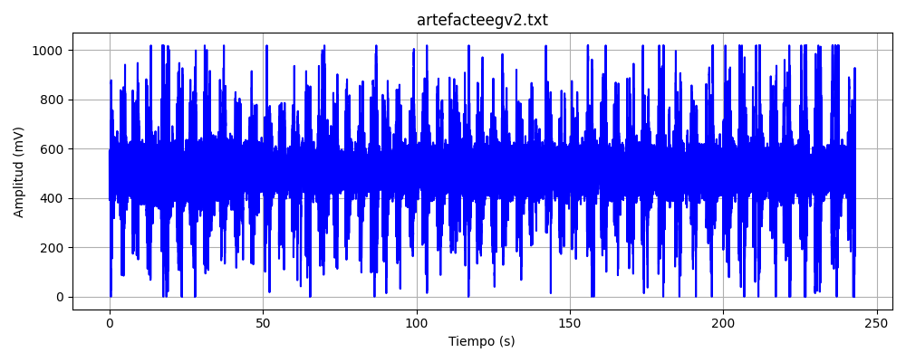
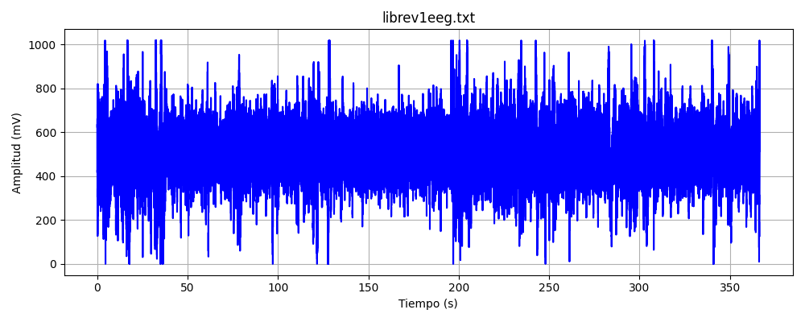
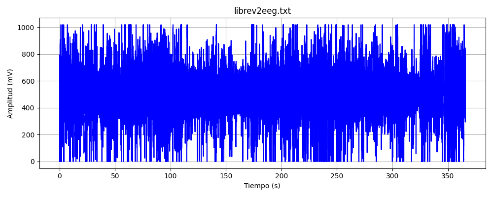

# Laboratorio 5

## Introducción
La electroencefalografía (EEG) es una técnica no invasiva que permite registrar la actividad eléctrica del cerebro mediante electrodos colocados en el cuero cabelludo. Esta técnica se basa en la detección de potenciales eléctricos generados por la actividad sináptica de las neuronas corticales, y ha sido ampliamente utilizada para el estudio de estados de conciencia, procesos cognitivos, y diagnósticos clínicos como epilepsia o trastornos del sueño.
El sistema de posicionamiento 10–20 es un estándar internacional para la colocación de electrodos EEG. En esta práctica se utilizaron las ubicaciones Fp1, Fp2 y O2, asociadas con las regiones frontales y occipitales del cerebro. Se empleó el dispositivo BiTalino (r)evolution Board Kit BLE/BT, el cual posee una ganancia interna de 40,000 y filtro pasabanda de 0.8–48 Hz, permitiendo registrar señales cerebrales con una resolución de 10 bits.
El objetivo fue registrar y analizar señales EEG en diferentes condiciones: basal (ojos abiertos y cerrados), durante una tarea cognitiva y con presencia de artefactos, reconociendo la presencia de bandas de frecuencia características como delta (δ), theta (θ), alfa (α) y beta (β), relacionadas con distintos estados mentales y funciones cerebrales

## Procedimiento
Preparación del sistema: Se instaló el software OpenSignals y se emparejó el dispositivo BiTalino. Se configuró el canal A4 para EEG.

1. Colocación de electrodos: Tras limpiar las áreas correspondientes, se colocaron los electrodos en las posiciones Fp1, Fp2 y mastoide. 
2. Adquisición de datos: Se registraron señales EEG en las siguientes condiciones:
  - Basal con ojos abiertos (1 min)
  - Basal con ojos cerrados (1 min)
  - Tarea cognitiva (2 min): conteo regresivo de 7 en 7 desde 100
  - Artefactos controlados (2 min): parpadeo y masticación
  - Libre (6 min): actividad definida por el grupo (ej. música o respiración)

## Resultados
| Condición | Gráfica | Descripción |
| --------- | ------- | ----------- |
| Basal con ojos abiertos |  | Descripción |
| Basal con ojos abiertos |  | Descripción |
| Basal con ojos cerrados |  | Descripción |
| Basal con ojos cerrados |  | Descripción |
| Tarea cognitiva |  | Descripción |
| Artefactos controlados |  | Descripción |
| Artefactos controlados |  | Descripción |
| Libre1 |  | Descripción |
| Libre2 |  | Descripción |

## Referencias
[1] Nunez, P. L., & Srinivasan, R. (2006). Electric Fields of the Brain: The neurophysics of EEG. Oxford University Press.
[2] Niedermeyer, E., & da Silva, F. L. (2005). Electroencephalography: Basic principles, clinical applications, and related fields. Lippincott Williams & Wilkins.

