# 🧪 Filtrado de Señales EMG — Laboratorio de Procesamiento de Señales

## 🎯 Objetivo

Filtrar las señales EMG para eliminar ruido y artefactos, y aislar la actividad muscular efectiva. Se utilizó un dataset real obtenido con sensores EMG deltoides bajo tres condiciones:

- **Reposo**
- **Contracción Débil**
- **Contracción Fuerte**

Se aplicaron filtros IIR y FIR para mejorar la claridad de la señal muscular.

---

## ⚙️ Filtros Diseñados

### 🔸 Filtro IIR (Butterworth)
- Tipo: Paso bajo
- Orden: 4
- Frecuencia de corte: 60 Hz
- Objetivo: Eliminar frecuencias altas asociadas a artefactos eléctricos y de movimiento.

### 🔹 Filtro FIR (Hamming)
- Tipo: Paso bajo
- Número de coeficientes: 51
- Frecuencia de corte: 40 Hz
- Objetivo: Aislar la banda de interés de la señal muscular.

---

## 📊 Tabla resumen de resultados

| Campo de Actividad      | Señal Cruda (1ra muestra) | Filtrada IIR | Filtrada FIR |
|-------------------------|---------------------------|---------------|---------------|
| Reposo                  | `valor`                   | `valor`       | `valor`       |
| Contracción Débil       | `valor`                   | `valor`       | `valor`       |
| Contracción Fuerte      | `valor`                   | `valor`       | `valor`       |

> 💡 Los valores pueden ser reemplazados por las primeras muestras o medidas representativas (como media, RMS o mediana).

---

## 📷 Resultados Visuales

### Reposo - Deltoides

| Superposición de señales | Cruda | IIR | FIR |
|--------------------------|-------|-----|-----|
| 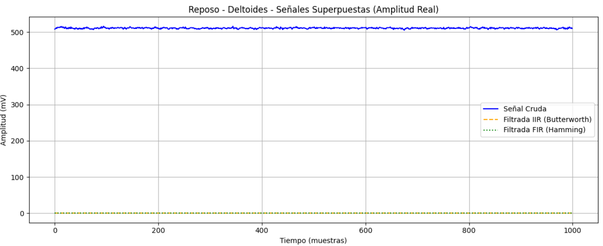 | 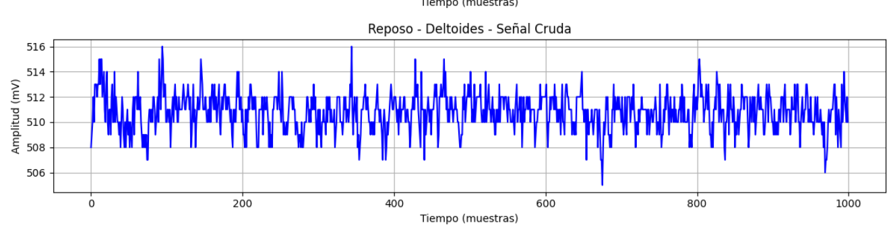 | 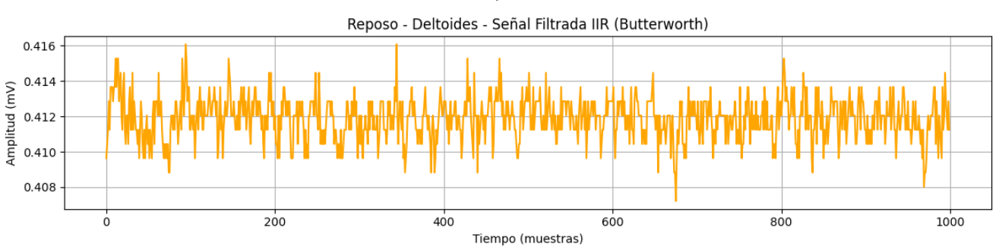 | 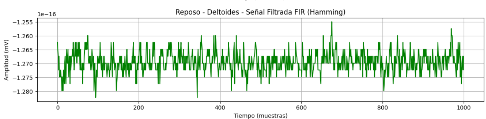 |

### Contracción Débil - Deltoides

| Superposición de señales | Cruda | IIR | FIR |
|--------------------------|-------|-----|-----|
| 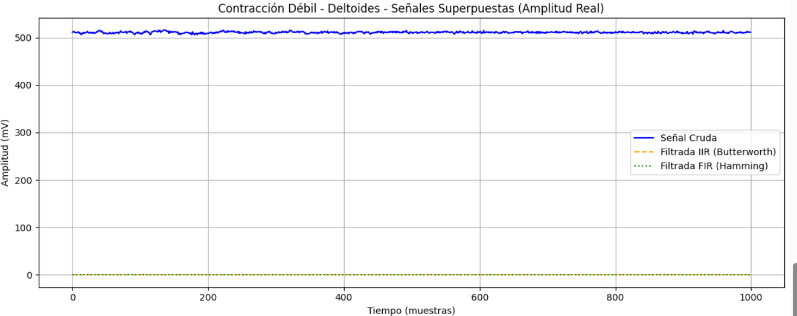 | 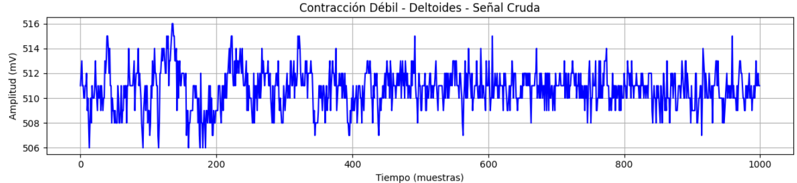 | 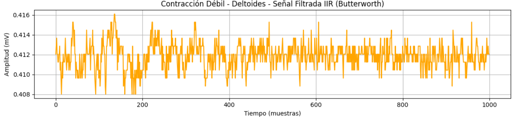 | 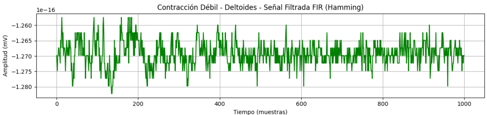 |

### Contracción Fuerte - Deltoides

| Superposición de señales | Cruda | IIR | FIR |
|--------------------------|-------|-----|-----|
| 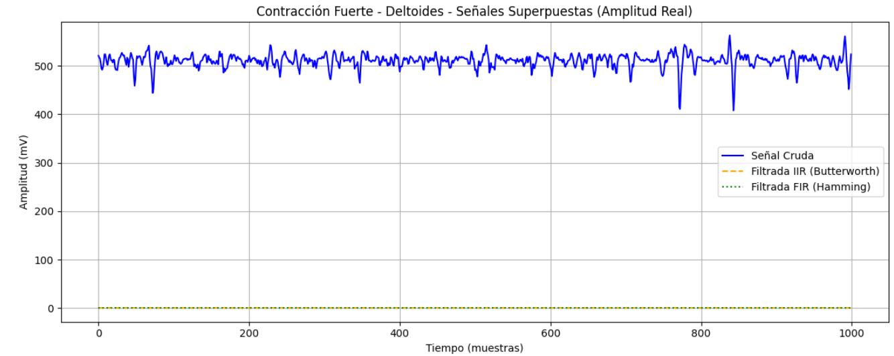 | 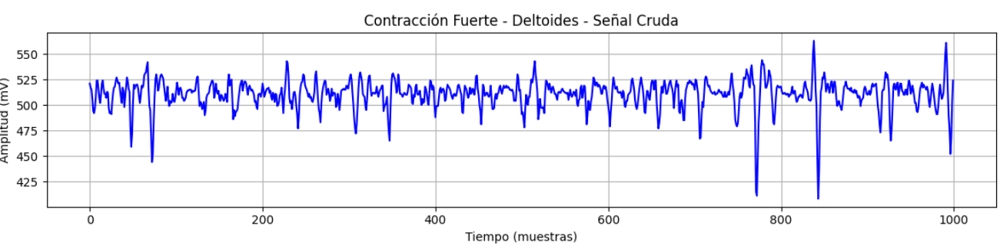 | 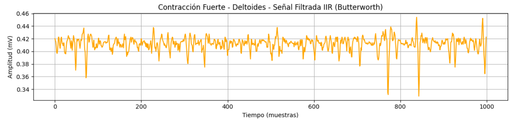 | 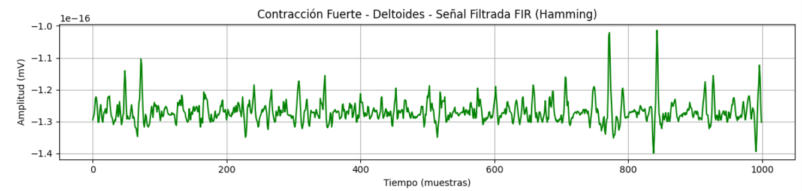 |

---

## 📝 Notas

- El filtrado IIR mostró una reducción agresiva de componentes de alta frecuencia.
- El filtrado FIR suavizó la señal preservando componentes de baja frecuencia.
- Se identifican diferencias claras entre los estados musculares en las señales filtradas.

---

## 📁 Estructura del repositorio

