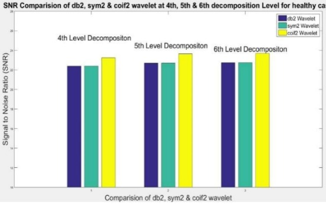

# Informe Técnico: Uso de Mother Wavelet para Filtrado de Señales EMG

## 1. Introducción

Las señales electromiográficas (EMG) son ampliamente utilizadas para estudiar la actividad eléctrica generada por los músculos esqueléticos. Estas señales, sin embargo, están frecuentemente contaminadas con ruido proveniente de diversas fuentes técnicas y biológicas, lo que dificulta su interpretación clínica. Por ello, resulta fundamental implementar métodos de procesamiento de señales que permitan mejorar su calidad.

El presente informe analiza un estudio que compara el rendimiento de diferentes funciones madre wavelet para eliminar ruido en señales EMG, con el fin de identificar cuál de ellas resulta más efectiva para este propósito.

## 2. Objetivo del Estudio

Evaluar el desempeño de tres familias de wavelets—**Daubechies2 (db2)**, **Symlet2 (sym2)** y **Coiflet2 (coif2)**—en la eliminación de ruido en señales EMG de sujetos sanos, utilizando el método de descomposición wavelet y comparando los resultados mediante la relación señal/ruido (SNR).

## 3. Metodología

### 3.1 Dataset

Se utilizó un conjunto de datos públicos, correspondiente a señales EMG de sujetos sanos.

### 3.2 Procesamiento de Señales

- Se aplicó la **transformada wavelet discreta (DWT)** para la descomposición de la señal.
- Se probaron tres niveles de descomposición: **4to, 5to y 6to nivel**.
- El proceso de *thresholding* (umbralización) fue realizado mediante el **método de umbral universal**, calculado a partir de los coeficientes detallados de la señal.

### 3.3 Wavelets Usadas

- **Daubechies2 (db2)**
- **Symlet2 (sym2)**
- **Coiflet2 (coif2)**

### 3.4 Herramienta

El procesamiento y análisis se realizaron en **MATLAB**.

## 4. Resultados

Se evaluó el rendimiento de cada wavelet usando la **relación señal/ruido (SNR)**.

Comparación de la relación señal-ruido (dB) de la señal EMG de un sujeto sano tras la descomposición de nivel 4, 5 y 6 mediante wavelet de Daubechies², Symlet² y Coiflet².

**Resultados para un sujeto (en dB):**

| Nivel de Descomposición | db2  | sym2 | coif2 |
|-------------------------|------|------|--------|
| 4to nivel               | 21.37 | 21.37 | **22.04** |
| 5to nivel               | 21.68 | 21.68 | **22.44** |
| 6to nivel               | 21.73 | 21.73 | **22.49** |

- **Coiflet2** obtuvo el mejor desempeño en todos los niveles.
- El análisis fue repetido para **10 sujetos**, obteniéndose resultados consistentes.

## 5. Conclusión

El estudio demuestra que, si bien la wavelet Daubechies ha sido tradicionalmente utilizada para el análisis de señales EMG, la **wavelet Coiflet2 (coif2)** mostró un mejor rendimiento en la eliminación de ruido en señales no estacionarias como las EMG. Esto sugiere su mayor idoneidad para aplicaciones biomédicas que requieren alta precisión en el procesamiento de señales.

---

**Referencia**:  
Dubey, Alok & Singh, Rupali & Rai, Amrita. (2024). Noise Removal of EMG Signal for Healthy Person Using Wavelet Decomposition Method with Three Different Wavelet Families to Identify the Best Wavelet for Noise Removal. 1-7. 10.1109/ICSCAI61790.2024.10866342. 

