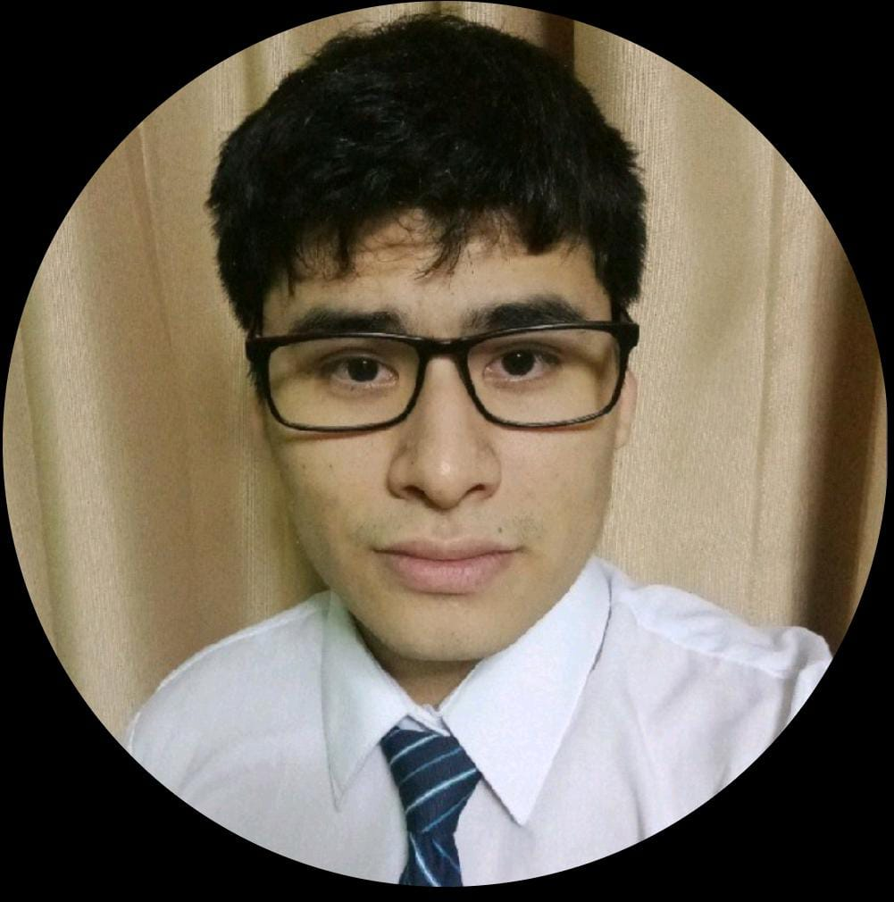

# GRUPO-1-ISB-2025-1

## Integrantes del equipo

Este es el repositorio principal para el curso, en el que se subirán los archivos y entregables relevantes. Somos el equipo #1.

| Foto | Información |
|------|-------------|
|  | **Sebastian Torres** <i><u style="color:blue">sebastian.torres@upch.pe</u></i> ¡Qué tal! yo soy estudiante de octavo ciclo con interés en ingeniería clínica y mantenimiento de equipos. Mi deseo es aprender de todo y aplicarlo para soluciones relevantes en nuestro campo. Me gusta beber agua y hacer música. |
| | **Axel Balboa** <i><u style="color:blue">axel.balboa@upch.pe</u></i> Soy estudiante de pregrado en Ingeniería Biomédica, actualmente cursando mis últimos ciclos. Tengo un gran interés y pasión por la biomecánica y la rehabilitación, especialmente en lo relacionado con la aplicación de tecnologías innovadoras como la impresión 3D. Me entusiasma explorar soluciones creativas y funcionales que impacten positivamente en la calidad de vida de las personas.|
|  | **Marx Rios** <i><u style="color:blue">marx.rios@eupch.pe</u></i> Hola, soy un estudiante de pregrado de Ingeniería Biomédica, actualmente en el 7mo ciclo. Me apasiona el diseño y desarrollo de dispositivos médicos, así como la investigación en tecnologías de rehabilitación y diagnóstico. Actualmente, estoy trabajando en proyectos relacionados con interfaces cerebro-máquina con un enfoque en la integración de AI y machine learning. Me interesa desarrollar soluciones innovadoras y escalables que mejoren la calidad de vida y la atención en salud. |
| | **Alvaro Aquije** <i><u style="color:blue">alvaro.aquije@upch.pe</u></i>  Me gusta programar y estudiar. Soy un alumno aplicado y responsable. Interesado en el area de telemedicina.|
|  | **Andre Rubio** <i><u style="color:blue">andre.rubio@upch.pe</u></i> Hola , soy un alumno de pregrado de ingeniería Biomédica, actualmente cursando el 7mo ciclo. Me considero un apasionado por la electronica que quisiera enfocarse en el desarrollo y mantenimiento de equipos medicos. |

## Estructura del repositorio
- `CITI program - certificados/`
- `Laboratorios/`
  - `Laboratorio 1 - Git y Github/`
- `Proyecto/`
  - `Hardware/`
  - `Software/`
